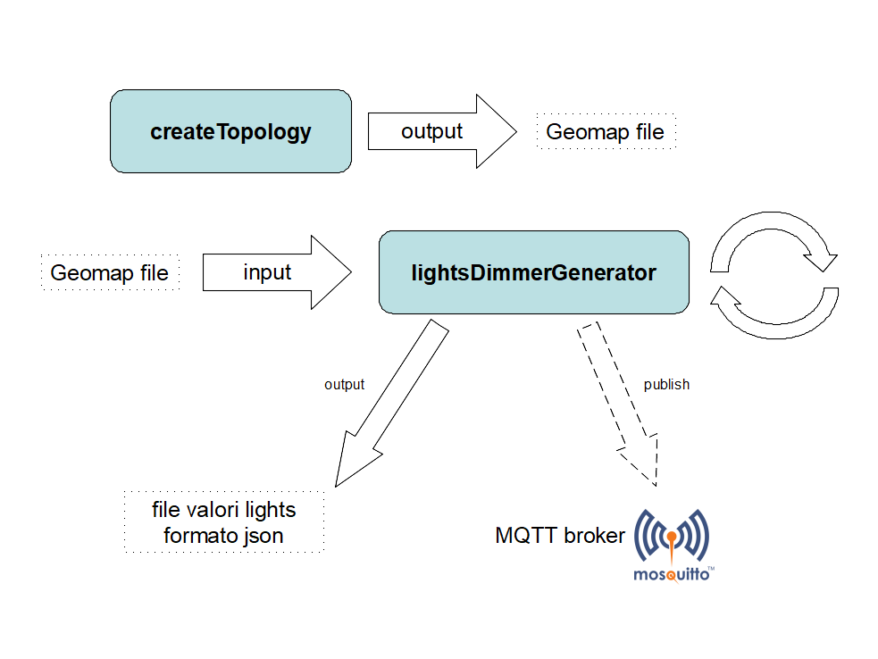

# AxHeatMapsIoTSimulator
Composta da due applicazioni:
1. **CREATE TOPOLOGY** - crea un file topologia delle luci per dei test;
1. **TRAFFIC GENERATOR** - in base a un file topologia delle luci, pubblica dati valore dimmer luci su coda MQTT - le pubblicazioni su coda MQTT, con valori di dimmer generati in modo random, sono periodiche ogni tot secondi;



## CREATE TOPOLOGY

`node ./createTopology.js`

programma per creazione di file formato Geomap.

Esempio formato file Geomap:

`ID000;Lamp 1;00158D00019A5E07;0.0034936043;0.0045115078;0|ID001;Lamp 2;00158D00010A4C57;0.0032502170;0.0043601978;1|ID002;Lamp 3;00158D00010A4C47;0.0034158439;0.0043624436;1|ID003;Lamp 4;00158D00010A48EC;0.0035820322;0.0043607593;1|ID004;Lamp 5;00158D00010A4C67;0.0037889254;0.0043610400;1|`

carattere `|` per separare i record, descrizione singola lampada.

`ID000;GW HeatMap;00158D00019A5E07;0.0034936043;0.0045115078;0`

quindi `;` per separare i valori della lampada all'interno dei record:

```
ID000 --> id
Lamp 1 --> Nome lampada
00158D00019A5E07 --> Indirizzo MAC

0.0034936043;0.0045115078 --> due coordinate, latitudine e longitudine

0 --> ???
```
il formato dell'indirizzo MAC è `00158D000AAAA<num id, da 0 a max 150, con padding left A>` es: `00158D000AAAAA72`.

### CONFIGURAZIONE

Creare un file `.env` basandosi sul file `.env_template`

`NUM_LIGHTS` e `PATH_OUTPUT_GEOMAP`

| **PARAMETRO**      | **DESCRIZIONE**           | **DEFAULT**  |
| ------------- |-------------| -----|
| `NUM_LIGHTS`      | numero di luci per cui viene generato il file Geomap. Valore massimo 150 | `100` |
| `PATH_OUTPUT_GEOMAP`      | path di output file Geomap      |   `./out/Geomap_out.txt` |

## TRAFFIC GENERATOR

`node ./lightsDimmerGenerator.js`

Legge il file Geomap e simula dei dati sul dimmer luci inviandoli su coda MQTT.  

Sotto `./out/dump_lights.json` il dump della situazione lampade aggiornato in base ai dati generati; il file .json è un array di oggetti, ognuno che descrive
l'ultimo stato della lampada, ad esempio:

```
{"id":"ID000","lightName":"Lamp 1","macAddress":"00158D000AAAAAA0","lat":"0.8995589272","lng":"0.4372051831","misc":"0","dimmer":892}
```

con valorizzato il valore del dimmer.

Lo stesso stato è pubblicato tramite messaggi MQTT:

```
#.#NMEAS;MAC00158D000AAAAA49;IDN56;FWV0036;HMS18:09:00;DOY01;MTY2;PAR00158D00011B9CAE;LQI78;PKS0;PKR0;PKL0;VAC0;IAC0;PAT0;PRE0;CEA255;CER5;PW0900;PW1514;PW2900;TMP29;VCC3214;AD01;AD11;AD22;AD320;MOS4;#!##.#NMEAS;MAC00158D000AAAAA74;IDN56;FWV0036;HMS18:09:00;DOY01;MTY2;PAR00158D00011B9CAE;LQI78;PKS0;PKR0;PKL0;VAC0;IAC0;PAT0;PRE0;CEA255;CER5;PW0900;PW1495;PW2900;TMP29;VCC3214;AD01;AD11;AD22;AD320;MOS4;#!#
```

con tag `#.#` e `#!#` di apertura e chiusura dei valori e `PW1....` valore del dimmer; i signoli campi sono separati da `;`.

Tramite il parametro `DO_EXTRA_LIGHTS` è possibile generare traffico random amche di luci con indirizzo MAC non tra quelli del file Geomap. Il formato degli indirizzi MAC di queste luci è `MAC11900Z000BBBB<num id, da 300 a max 500>`.

### CONFIGURAZIONE

Creare un file `.env` basandosi sul file `.env_template`

| **PARAMETRO**      | **DESCRIZIONE**           | **DEFAULT**  |
| ------------- |-------------| -----|
| `HOST_MQTT_SERVER` | hostname o IP address server MQTT | `localhost`|
| `QUEUE_NAME` | nome della coda su cui sono pubblicati i messaggi | nessun default - parametro obbligatorio |
| `PATH_INPUT_GEOMAP`      | path file descrizione lights | `./out/Geomap.txt` |
| `PATH_OUTPUT_DUMP_LIGHTS`      | path di output file daum valori lights      |   `./out/dump_lights.json` |
|`INTERVAL_SENDING_MSG` | numero di sec di intervallo tra nuovi messaggi | `6` |
|`DO_EXTRA_LIGHTS` | genera lavori di luci oltre a quelle gestite con range id: 300 - 500. Valori validi: `ON`, `On`, `on`, `Off`, `OFF`, `off` | `ON` | 